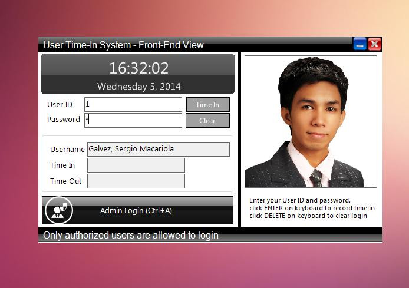

# User Time Log System using VB.NET and MS Access Database

### Description
A system that acts as biometrics does. With real-time logging, this system makes it possible to record the time-in and time-out of a user's attendance with ease. It provides a user-friendly UI and shortcut keys and for fast processing of records and logging.

### Features

<strong>Admin</strong>
<ul>
  <li><strong>User List</strong></li>
  <li><strong>User Form (Add/Edit)</strong></li>
  <li><strong>Log History</strong></li>
</ul>
<strong>Public</strong>
<ul>
  <li><strong>Time In/Out Log</strong></li>
</ul>

Visit [sourcecodester.com](https://www.sourcecodester.com/visual-basic-net/8285/user-time-system-using-vbnet-and-ms-access.html) for more information and detailed explaination of the uploader/developer about this project.

### Website Info

| Title | User Time Log System using VB.NET and MS Access Database with Source Code |
|:---|:---|
| Website | [www.sourcecodester.com](https://www.sourcecodester.com) |
| Link | https://www.sourcecodester.com/visual-basic-net/8285/user-time-system-using-vbnet-and-ms-access.html |
| Language | VB.NET |
| Developer/Uploader | [galvez15](https://www.sourcecodester.com/users/galvez15) |
